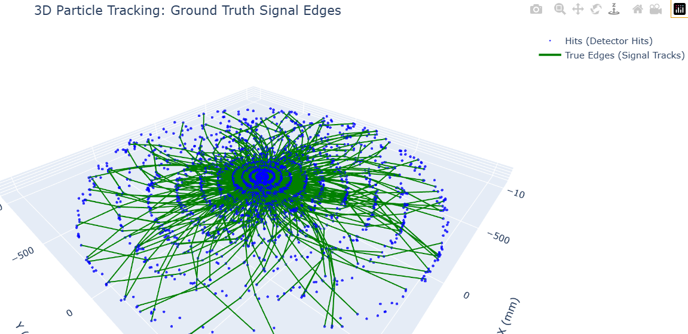

# TrackML Particle Tracking: Interaction Network (GNN) Prototype

## By Gabriel Padilla Haro

## 🛠️ Description

**Note:** This is only a prototype of the intended model, which is still under development. Efficiency improvements, parameter adjustments, and even the exploration of new methods for reconstructing trajectories from GNN results must be implemented.

The Large Hadron Collider (LHC) at CERN produces massive amounts of data from particle collisions. The goal of this program is to reconstruct the original paths (tracks) of particles by connecting 3D coordinates (hits) recorded by silicon detectors. We utilize an Interaction Network (IN) to perform Edge Classification, predicting whether a segment between two hits is a real particle trajectory or not. The original data can be found at (https://www.kaggle.com/c/trackml-particle-identification). 

This project implements a **Graph Neural Network (GNN)**, specifically an **Interaction Network (IN)**, to reconstruct particle trajectories from the **TrackML Particle Identification** challenge dataset. We have use generative AI tools such as programming assistants and technical tutoring.

Our approach uses a GNN where:
* **Nodes**: Represent individual detector hits.
* **Edges**: Represent potential connections between hits.
* **Goal**: Perform **Edge Classification** to predict which connections belong to real particle tracks (Target 1) and which are noise (Target 0).

## 🛠️ Technical Workflow

### 1. Data Preprocessing & Filtering
To optimize performance, we focus on the **Pixel Tracker** (innermost layers 8, 13, and 17). We also use **cylindrical coordinates** $(r, \phi, z)$ to exploit the detector's radial symmetry.

### 2. Graph Construction
We build the graph by applying physical constraints to limit the number of edges:
* **Layer-to-Layer Constraint**: Connections are only proposed between hits in adjacent layers.
* **Angular Difference ($\Delta \phi$)**: Only hits with small angular changes are connected, reflecting high-momentum trajectories.
* **Z-Distance ($\Delta z$)**: Limits connections between hits that are physically too far apart along the beam axis.

### 3. GNN Architecture (Interaction Network)
The `TrackNet` model utilizes a **Message Passing** paradigm:
* **Edge MLP (Interaction)**: Analyzes 15 geometric features between two hits to determine their affinity.
* **Node MLP (Update)**: Aggregates information from all neighboring edges and updates the hit’s state with topological context.
* **Normalization**: Implements normalization and sigmoid activation on aggregated messages to ensure numerical stability and balance between spatial and topological data.

### 4. Reconstruction
So far, a **Greedy Path Following** algorithm appears to be the best way to reconstruct the trajectories:
* **Seeding**: Starts from hits in the innermost layer.
* **Mutual Exclusion**: Once a hit is assigned to a track, it is marked as "used" to prevent overlapping.
* **Radial Flow**: Forces tracks to move strictly outward ($r_{dst} > r_{src}$), eliminating unphysical "zig-zag" connections within the same layer.
  
## 🚀 Technologies Used
- **Languages:** Python.
- **Libraries:** Torch, Torch Geometric, Scipy, NumPy, Pandas, Plotly.
- **Tools:** Jupyter Notebook, VSCode, Gemini.

## 💡 Key Considerations
1. The model tends to overfit towards the negative class (false edges) due to the large class imbalance. Weights have been adjusted to lessen their impact, although the results are far from perfect. In particular, training over many periods seems to exacerbate this problem.
2. Methods for extracting trajectories from edge scores are being explored. So far, the use of connected components and a greedy approach has been explored.
3. Methods to improve efficiency should be explored, as we are analyzing only a tiny fraction of the data generated by the collider.

